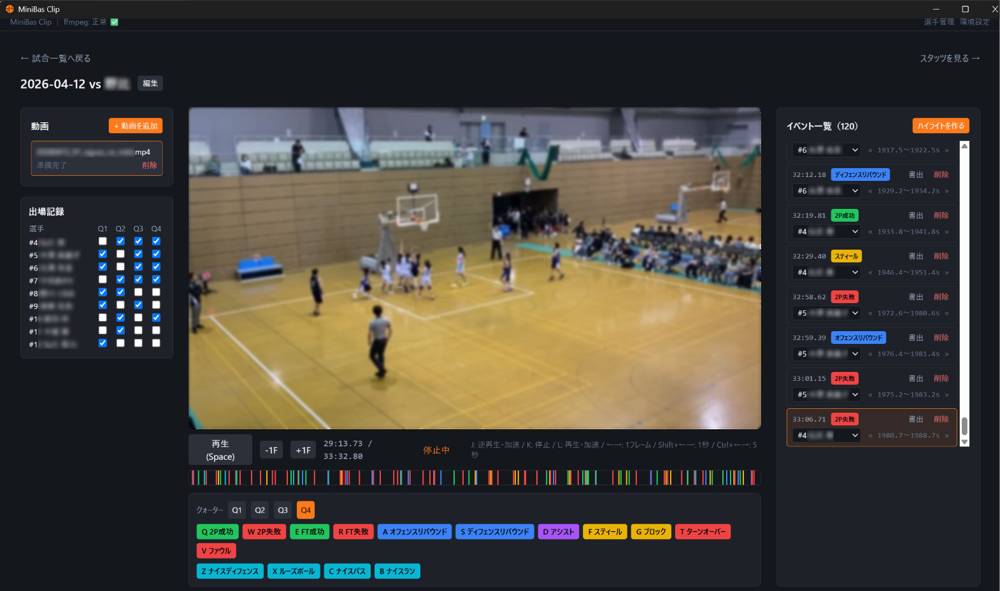

# MiniBas Clip

ミニバス（U12バスケ）の自チーム向け、試合映像タグ付け・スタッツ集計・選手別ハイライト書き出しアプリ（Windows / Electron）。

保護者撮影の試合動画を取り込み、キーボードショートカットでプレイにタグ付け → 選手別スタッツを自動集計 → 選手ごとのハイライトMP4を書き出せます。書き出したMP4はLINEなどで手動で共有してください（アプリ内に共有機能はありません）。

映像・データはすべてローカル保存で、クラウドは使用しません。



## ダウンロード

[Releases](../../releases) から最新のインストーラー（`MiniBas Clip-x.x.x-setup.exe`）をダウンロードしてください。

署名していないため、実行時にWindows SmartScreenの警告が出ることがあります。「詳細情報」→「実行」で進められます。

## アンインストール

アンインストールしてもアプリ本体が消えるだけで、試合データ・選手情報・変換済み動画などのデータは`%APPDATA%\MiniBas Clip`フォルダに残ります（誤って再インストール目的でアンインストールした場合にデータが消えないようにするためです）。

完全にデータも削除したい場合は、アンインストール後に上記フォルダを手動で削除してください。

## 主な機能

- 動画取り込み・再生（J/K/Lシャトル、コマ送り、最大8倍速）
- キーボードショートカットでのプレイタグ付け（2P/FT/リバウンド/アシスト等 + ハイライト系）
- クォーター別の出場記録
- 選手別・シーズン別（学年度）のスタッツ集計、CSV書き出し
- クリップ単体書き出し／選手別・チーム別ハイライト動画の自動結合書き出し（タイトルカード・キャプション対応）
- 選手管理（シーズンごとの背番号・学年、名簿コピー機能）

## 開発

```bash
npm install
npm run dev        # 開発起動
npm run typecheck  # 型チェック
npm run build:win  # Windowsインストーラーのビルド
```
